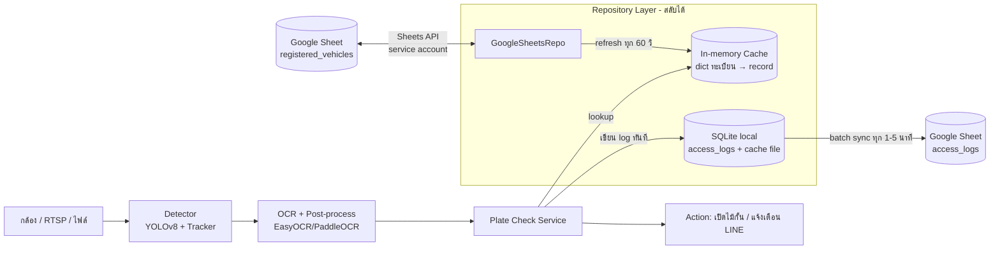

# Design: ระบบตรวจป้ายทะเบียนไทย + Google Sheets เป็นฐานข้อมูลเบื้องต้น

## คำตอบสั้น: ไหวไหม?

**ไหว** สำหรับ MVP / ใช้งานขนาดเล็ก (ลานจอดรถ หมู่บ้าน โรงงาน ทะเบียนไม่เกินหลักหมื่น คัน/นาทีไม่มาก)
โดยมีเงื่อนไขว่า **ห้าม query Sheets ทุกครั้งที่ตรวจเจอป้าย** ให้โหลดทั้งตารางมาเก็บ cache ในหน่วยความจำแล้วค้นในเครื่องแทน

| ข้อจำกัดของ Google Sheets | ผลกระทบ | วิธีรับมือ |
|---|---|---|
| Latency ต่อ request ~0.3–1 วินาที | ช้าเกินไปถ้าเรียกทุกครั้ง | In-memory cache, refresh ทุก 30–60 วินาที |
| Quota API: ~60 read/นาที/ผู้ใช้ (300/นาที/โปรเจกต์) | เกิน quota แล้วโดน 429 | อ่านทั้งชีตครั้งเดียวต่อรอบ, ใช้ exponential backoff |
| ไม่มี unique constraint / transaction | ทะเบียนซ้ำ, เขียนชนกัน | ตรวจซ้ำตอน load cache, log ใช้ append-only |
| ล่มหรือเน็ตหลุดได้ | ระบบตรวจไม่ได้ | ใช้ cache ล่าสุดต่อ + เก็บ cache ลงไฟล์ local |
| เขียน log ถี่ๆ ช้า/โดน quota | ระบบหน่วง | เขียน log ลง SQLite local ก่อน แล้ว batch append ขึ้น Sheets ทุก 1–5 นาที |
| จำกัด 10 ล้านเซลล์/ไฟล์ | log โตเต็ม | log ใหญ่ย้ายเก็บ local/DB, Sheets เก็บแค่ทะเบียนและสรุป |

ถ้าโตเกินนี้ (ทะเบียนหลายหมื่น, หลายกล้อง, ต้องการ transaction) ค่อยย้ายไป PostgreSQL โดยเปลี่ยนแค่ชั้น Repository

## สถาปัตยกรรม



## โครงสร้าง Google Sheet

**ชีต `registered_vehicles`** (แถวแรกเป็น header)

| plate_number | province | owner_name | vehicle_type | status | valid_until | note |
|---|---|---|---|---|---|---|
| 1กก1234 | กรุงเทพมหานคร | สมชาย ใจดี | รถยนต์ | active | 2026-12-31 | |

- `plate_number` เก็บแบบ normalize แล้ว (ไม่มีช่องว่าง/ขีด) ใช้ data validation กันค่าผิดรูปแบบ
- `status`: `active` / `blocked` / `expired` (dropdown)
- key สำหรับค้น = `plate_number|province`

**ชีต `access_logs`** (append-only): `detected_at, camera_id, plate_text, province, ocr_conf, result, image_path`

## ส่วนประกอบของโค้ด

```
src/
  detector.py        # YOLO ตรวจป้าย + tracker
  ocr.py             # อ่านตัวอักษรไทย
  normalize.py       # ล้างข้อความ, regex รูปแบบป้ายไทย, แก้ตัวอักษรสับสน
  repo/
    base.py          # interface VehicleRepo: load_all(), log(entry)
    gsheets.py       # Google Sheets (gspread + service account)
    sqlite.py        # ใช้แทนภายหลัง / เก็บ log local
  service.py         # check_plate(): cache lookup + fuzzy + ตัดสินใจ
  sync.py            # thread refresh cache + batch upload log
  main.py            # วนรับเฟรม → detect → OCR → check → action
config.yaml          # sheet id, refresh interval, conf threshold, camera list
```

## ตรรกะหลัก

```python
class PlateService:
    def __init__(self, repo, ttl=60):
        self.repo, self.ttl = repo, ttl
        self.cache, self.loaded_at = {}, 0

    def _refresh(self):
        try:
            rows = self.repo.load_all()               # 1 request อ่านทั้งชีต
            self.cache = {(r.plate, r.province): r for r in rows}
            self.loaded_at = time.time()
            save_local_snapshot(self.cache)           # สำรองไว้กรณี Sheets ล่ม
        except Exception:
            log.warning("sheets unavailable, using stale cache")

    def check(self, plate, province, conf):
        if time.time() - self.loaded_at > self.ttl:
            self._refresh()
        if conf < 0.6 or not valid_format(plate):
            return "review"
        rec = self.cache.get((plate, province)) or fuzzy_lookup(self.cache, plate, province)
        if rec and rec.status == "active" and not expired(rec):
            return "registered"
        return "unregistered"
```

- **Fuzzy lookup:** ถ้าไม่เจอตรงๆ ให้ลองระยะแก้ไข ≤ 1 ตัวอักษรด้วย `rapidfuzz` และถ้าเจอให้ผลเป็น `review` ไม่ใช่เปิดอัตโนมัติ
- **Debounce:** ใช้ track id กันการบันทึก/ตัดสินซ้ำของรถคันเดียวกันภายใน N วินาที

## การตั้งค่า Google Sheets

1. สร้างโปรเจกต์ใน Google Cloud เปิด Google Sheets API
2. สร้าง Service Account แล้วดาวน์โหลดคีย์ JSON (**ห้าม commit เข้า repo** ใส่ `.gitignore`)
3. แชร์ชีตให้อีเมลของ service account (สิทธิ์ Editor)
4. ใช้ไลบรารี `gspread` (`ws.get_all_records()` = 1 request)

## แผนต่อยอด

| ระยะ | สิ่งที่ทำ |
|---|---|
| MVP | 1 กล้อง, Sheets + cache, log ลง SQLite, ผลแสดงที่ console / ภาพ overlay |
| ต่อมา | แจ้งเตือน LINE Notify, หน้าเว็บ dashboard ดู log, ให้ผู้ดูแลแก้ทะเบียนใน Sheets ได้เลย |
| โต | ย้ายไป PostgreSQL (เปลี่ยนแค่ `repo/`), หลายกล้อง, แยก service ด้วย queue |

## ความเสี่ยง

- **PDPA:** ชื่อเจ้าของรถเป็นข้อมูลส่วนบุคคล จำกัดสิทธิ์แชร์ชีต และถ้าไม่จำเป็นอย่าเก็บชื่อ
- **ความถูกต้อง OCR:** ผลที่ไม่มั่นใจต้องไม่เปิดทางอัตโนมัติ ให้ไปทางตรวจด้วยคน
- **แก้ไขชีตพร้อมกัน:** คนแก้ผิดรูปแบบจะทำให้ค้นไม่เจอ จึงต้อง validate ตอน load และ log แถวที่ผิด
