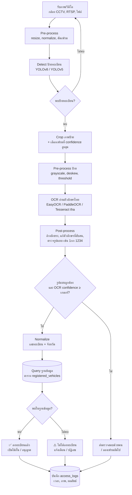

# Flow การทำงานระบบตรวจป้ายทะเบียนไทย (Object Detection + ตรวจสอบฐานข้อมูล)

## ภาพรวม



## ขั้นตอนโดยละเอียด

| # | ขั้นตอน | รายละเอียด | เครื่องมือแนะนำ |
|---|---------|-----------|-----------------|
| 1 | รับภาพ | อ่านเฟรมจากกล้อง/ไฟล์ ลดอัตราเฟรม (เช่น 5–10 fps) | OpenCV |
| 2 | Detect ป้าย | หา bounding box ของป้ายทะเบียน (class: `license_plate`) | YOLOv8 (train ด้วย dataset ป้ายไทย) |
| 3 | Crop + เลือกเฟรม | ตัดเฉพาะป้าย, ใช้ tracking (ByteTrack/SORT) เพื่อให้ 1 คัน = 1 ผลลัพธ์ | Ultralytics tracker |
| 4 | Pre-process ป้าย | แก้เอียง, เพิ่ม contrast, ขยายภาพ | OpenCV |
| 5 | OCR | อ่านบรรทัดบน (อักษรหมวด+เลข) และบรรทัดล่าง (จังหวัด) | EasyOCR(`th`,`en`) / PaddleOCR |
| 6 | Post-process | ลบช่องว่าง/สัญลักษณ์, ตรวจ regex เช่น `^\d?[ก-ฮ]{1,2}\d{1,4}$`, แก้ตัวที่ OCR สับสน (ถ/ภ, ง/ว ฯลฯ) | Python regex + fuzzy match |
| 7 | Query DB | ค้นด้วย `plate_number` + `province` (ถ้ามี) ถ้าไม่เจอตรงๆ ใช้ fuzzy (Levenshtein ≤ 1) เป็นตัวช่วย | SQL / SQLAlchemy |
| 8 | ตัดสินใจ | พบ → อนุญาต, ไม่พบ → แจ้งเตือน, confidence ต่ำ → ให้คนตรวจ | ตรรกะใน service |
| 9 | บันทึก log | เก็บเวลา, ภาพต้นฉบับ/ภาพป้าย, ข้อความที่อ่านได้, ผลตรวจ | DB + file storage |

## โครงสร้างฐานข้อมูล (ตัวอย่าง)

```sql
CREATE TABLE registered_vehicles (
    id            SERIAL PRIMARY KEY,
    plate_number  VARCHAR(20) NOT NULL,   -- เช่น '1กก1234' (ไม่มีช่องว่าง)
    province      VARCHAR(50) NOT NULL,   -- เช่น 'กรุงเทพมหานคร'
    owner_name    VARCHAR(100),
    vehicle_type  VARCHAR(30),
    status        VARCHAR(20) DEFAULT 'active',  -- active / blocked / expired
    valid_until   DATE,
    UNIQUE (plate_number, province)
);

CREATE TABLE access_logs (
    id            SERIAL PRIMARY KEY,
    detected_at   TIMESTAMP NOT NULL DEFAULT NOW(),
    plate_text    VARCHAR(20),
    province      VARCHAR(50),
    ocr_conf      REAL,
    result        VARCHAR(20),            -- registered / unregistered / review
    image_path    TEXT
);
```

## ตรรกะตัดสินใจ

```python
def check_plate(plate, province, conf):
    if conf < 0.6 or not valid_format(plate):
        return "review"
    row = db.find(plate, province)
    if row and row.status == "active" and (row.valid_until is None or row.valid_until >= today()):
        return "registered"
    return "unregistered"
```

## ข้อควรระวังเฉพาะป้ายไทย

- ป้ายมีหลายบรรทัด (หมวดอักษร/เลข, จังหวัด) และหลายสี (ขาว, เหลือง, เขียว ฯลฯ) ต้องมีตัวอย่างใน dataset
- ตัวอักษรไทยบางคู่ OCR สับสนง่าย จึงควรมี fuzzy match และเกณฑ์ confidence
- จังหวัดอ่านยากกว่าเลขทะเบียน ใช้เลขทะเบียนเป็นหลักและจังหวัดเป็นตัวยืนยัน
- ข้อมูลทะเบียน/เจ้าของเป็นข้อมูลส่วนบุคคล ต้องจำกัดสิทธิ์เข้าถึงและเก็บตาม PDPA
